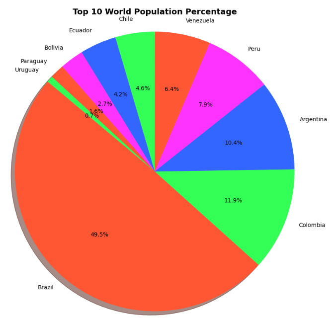

# World Demographics Data

## Description

This project provides a Python-based tool for visualizing and analyzing global demographic data from the provided `data.csv` file.

## Usage

- Choose between generating bar charts or pie charts.
- Visualize and analyze global demographic data.

## Data Source

The demographic data is provided in the `data.csv` file, based on data from [World_Population_Dataset](https://www.kaggle.com/datasets/iamsouravbanerjee/world-population-dataset/).

## Features

- Generate bar charts to visualize population trends of specific countries.
- Create pie charts to explore the population distribution across continents.
- Reusable functions for data processing and visualization.
- Data visualization with matplotlib.
- Data processing with pandas.

## Prerequisites

- Python (3.7 or higher)
- Required Python packages listed in `requirements.txt`

## Getting Started
```sh
git clone https://github.com/IngAamira/WorldDemographics.git
python3 -m venv env
source env/bin/activate
pip3 install -r requirements.txt
python3 main.py
```

## Pie Chart

Generate a pie chart showing the top N values from a list.

Args:
- labels (list): A list of labels for the pie chart.
- values (list): A list of values corresponding to each label.
- top_n (int): The number of top values to include in the chart.



## Bar Chart

Generate a bar chart showing the population of a specific country over the years.

Args:
- labels (list): A list of years.
- values (list): A list of corresponding population values.
- Country (str): The name of the country.

